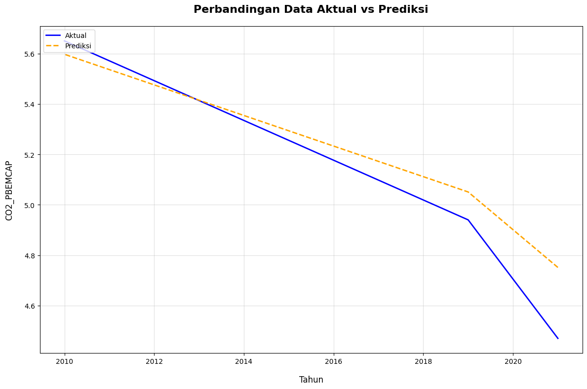
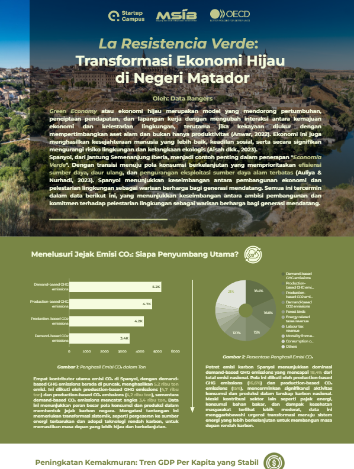
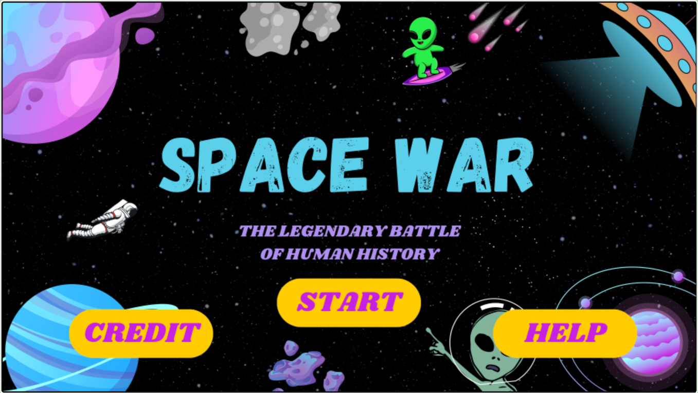

# My Projects Portfolio

Welcome to my GitHub portfolio! Below is a collection of projects demonstrating my expertise in data science, machine learning, web development, mobile app development, and game programming.

---

## 1. **[CO2 Emission Prediction - Spain](https://github.com/ikhsannovianto/co2-emission-prediction-spain)**  
  

**Technologies Used:** Python, Jupyter Notebook, Random Forest, scikit-learn, Pandas, Numpy  
Predicting CO2 emissions in Spain (2010–2022) based on industrial and economic indicators using **Random Forest Regression**. The project identifies key emission drivers and supports data-driven sustainability strategies.

**Key Highlights:**  
- Data preprocessing, EDA, and feature engineering  
- Model building and hyperparameter tuning for improved accuracy  
- Visualizations including learning curves and prediction comparisons

---

## 2. **[La Resistencia Verde: Transformasi Ekonomi Hijau di Negeri Matador](https://lookerstudio.google.com/reporting/10db9fac-35bb-42b5-b9b7-21a660affd7d)**  
  

**Technologies Used:** Looker Studio, Data Visualization  
An interactive dashboard analyzing Spain’s green economy transformation, with a focus on CO2 emissions, renewable energy adoption, and economic growth. Data-driven insights guide sustainability policy decisions.

**Key Highlights:**  
- Visualizing key metrics for Spain’s transition to sustainability  
- Interactive data exploration with insights for policy support  
- Available as a downloadable PDF for offline access

**Link:** [View the Report](https://lookerstudio.google.com/reporting/10db9fac-35bb-42b5-b9b7-21a660affd7d)

---

## 3. **[Iuran Warga Web App](https://github.com/ikhsannovianto/Iuran-Warga-App)**  
  

**Technologies Used:** PHP, Laravel, MySQL, XAMPP  
A web application built using **Laravel** for managing resident contributions. The app includes role-based access, CRUD functionality, and data export features to **Excel** and **PDF**.

**Key Highlights:**  
- Role management (Admin and User) with CRUD operations  
- Data export to Excel/PDF for reporting  
- Dashboard for tracking and visualizing payments  

---

## 4. **[Real Madrid Android App](https://github.com/ikhsannovianto/Real-Madrid-App)**  
  

**Technologies Used:** Kotlin, Android Studio, RecyclerView, Fragments  
An Android app developed in **Kotlin** to showcase Real Madrid legends with detailed player profiles displayed in a dynamic list. It features a fragment-based UI for seamless navigation.

**Key Highlights:**  
- Fragment-based UI (Home, Legend, Profile)  
- Dynamic player listing with detailed profiles  
- Applied object-oriented principles for maintainability and scalability  

---

## 5. **[Game Space War](https://github.com/ikhsannovianto/Game-Space-War)**  
  

**Technologies Used:** Java, Greenfoot  
A 2D arcade game developed using **Greenfoot** and **Java**, where players defend Earth from alien invaders. The game is built with a focus on **Object-Oriented Programming (OOP)** for modular design.

**Key Highlights:**  
- **OOP Principles:** Uses classes, inheritance, and encapsulation  
- Engaging gameplay with increasing difficulty  
- Immersive animations and sound effects  
- High score tracking to compete for the best performance

---

## **Connect with Me**  
Feel free to reach out or connect with me on LinkedIn for collaboration or discussions on these projects!

- [LinkedIn Profile](https://www.linkedin.com/in/ikhsanarinovianto)

---

## **License**  
This project is licensed under the **MIT License**. You can find the full text of the MIT License in the [LICENSE](LICENSE) file in this repository.
